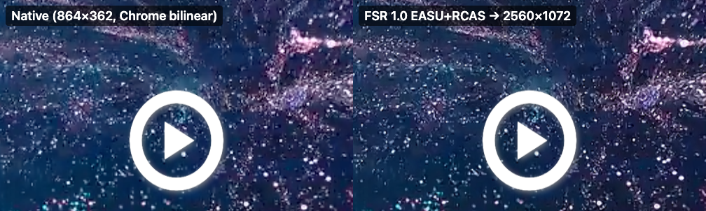

# Client-side upscaling research (September 8, 2026)

Goal: give the yifan.tv web player a 1080P or 2K picture even when the server only supplies the guest 576P stream, render the result **inside the existing player window**, and keep **full screen** and **picture-in-picture** working. This document records what was surveyed, what was measured on the live site, and the design that shipped in v1.2 as `extension/upscale.js`. `npm run research:upscale` measures the shipped module on the live site.

The server never sends more pixels than the selected tier. Upscaling reconstructs detail from the decoded frames on the viewer's GPU. It cannot equal a real 1080P encode and it does not change account entitlements, stream URLs, or the site's quality menu, which keeps saying 576P.

## What makes it possible on this site

`npm run research:upscale` inspected the public video [特立独行](https://www.yifan.tv/play/X4r3180qOd2) in a fresh, signed-out Chromium profile with the extension loaded:

| Fact | Measured value | Why it matters |
| --- | --- | --- |
| Playback library | hls.js over Media Source Extensions | The `<video>` source is a same-origin `blob:` URL, not the CDN URL. |
| Video `crossOrigin` | `anonymous`; CDN playlist and segments answer with `Access-Control-Allow-Origin: *` | Frames can be read by canvas and WebGL. |
| Canvas taint test | 2D `getImageData` succeeds; WebGL2 `texImage2D(video)` returns no error | The blocking risk for any browser upscaler is absent. |
| Decoded frame size | 864 × 362 for the "576P" tier | The site's label overstates the real height; the upscale ratio to 1080P is about 2.2× and to 2K about 3×. |
| Browser APIs | `requestVideoFrameCallback`, WebGL2, WebGPU (Metal), element PiP, Document PiP all present in the bundled Chrome 153 | Every building block of the design is available without flags. |

If the site ever moved to a plain cross-origin `<video src>` without CORS headers, WebGL would throw a `SecurityError` and the feature would have to switch itself off. The detection is one `texImage2D` call at start-up.

## Options surveyed

| Approach | Content fit | Real-time on integrated GPUs | Notes |
| --- | --- | --- | --- |
| **AMD FidelityFX Super Resolution 1.0 (EASU + RCAS), WebGL2** | Any content, including live-action film | Yes; measured below | MIT, two fragment shaders, no models to download. [GPUOpen reference](https://gpuopen.com/manuals/fidelityfx_sdk/techniques/super-resolution-spatial/), [WebGL port](https://github.com/Hajime-san/web-fsr). **Recommended.** |
| Anime4K CNN pipelines, WebGPU | Anime and flat-shaded art; not tuned for film grain or faces | Yes on WebGPU; about 3 ms at 720P per the project | MIT, `anime4k-webgpu` on npm, presets ModeA/B/C. [Anime4K-WebGPU](https://github.com/Anime4KWebBoost/Anime4K-WebGPU), [anime4k-wgpu](https://github.com/SegaraRai/anime4k-wgpu), [NijiLucid extension](https://github.com/chenmozhijin/Anime4K-WebExtension). Worth offering as an optional mode for animated titles. |
| Neural super-resolution (ESRGAN family, `websr`, UpscalerJS) | Best quality | No at 1080P/2K on laptop GPUs | Fine for stills; frame times are tens to hundreds of milliseconds. Not viable for 24 fps video. |
| Chrome/Edge built-in Video Super Resolution (NVIDIA RTX VSR, Intel VSR) | Any | Yes | Windows plus a supported discrete GPU only; nothing an extension can enable, and not available on macOS. [NVIDIA FAQ](https://nvidia.custhelp.com/app/answers/detail/a_id/5448/~/rtx-video-super-resolution-faq). |
| Plain CSS scaling (what happens today) | Any | Free | Chrome's bilinear filter; soft on Retina displays and in full screen. This is the baseline in the comparison images. |
| Requesting a higher stream from the server | Any | n/a | Already covered by the v1.1 quality adapter; guests are not offered an HD path, so there is nothing to select. |

Lanczos or bicubic shaders were also considered. FSR's EASU is a directionally adaptive Lanczos-2 with deringing, so it strictly improves on them at similar cost, and RCAS adds a bounded sharpening pass.

## Recommended design

```
hls.js ──▶ <video id="video_player"> (unchanged: audio, controls, seeking, ads filtering)
              │ requestVideoFrameCallback (one callback per decoded frame)
              ▼
        WebGL2 texture ──▶ EASU pass (framebuffer at 1920×N or 2560×N) ──▶ RCAS pass ──▶ <canvas> overlay
                                                                                        │
                                             positioned over the video's object-fit box │
                                             inside vg-player, under the site's controls│
                                                                                        ├─▶ full screen: vg-player is the fullscreen element, canvas follows it
                                                                                        └─▶ PiP: canvas.captureStream() ──▶ hidden <video> ──▶ requestPictureInPicture()
```

Same window. The canvas is inserted as a sibling of the site's `<video>` inside `vg-player#main-player`, absolutely positioned over the video's `object-fit: contain` box so letterboxing is identical, with `pointer-events: none`. The site's danmu layer, title bar, and controls already render above it (see `artifacts/upscale-fullscreen.png`). The original `<video>` keeps playing underneath: audio, seeking, the quality menu, subtitles, and the v1.0 ad filtering are untouched. A `ResizeObserver` on the player plus the video's `resize` event keep the overlay aligned and reallocate the framebuffer when the source dimensions change (episode change, quality change).

Output size. The backing store is 1920 wide for "1080P" and 2560 wide for "2K"; height follows the source aspect ratio and is capped at 1080 or 1440. For this 2.39:1 film that is 1920 × 804 and 2560 × 1072. On a Retina display the 840 CSS-pixel player is 1680 device pixels wide, so even windowed playback benefits; in full screen on a 1440-pixel-wide window it is 2880 device pixels.

Full screen. The site's own button fullscreens `vg-player#main-player`; because the canvas lives inside that element, no extra handling is needed beyond the layout update on `fullscreenchange`. Measured: fullscreen element `vg-player#main-player`, canvas inside it, canvas resized to 1440 × 603 CSS pixels (the full width of the fullscreen viewport), rendering continued at 23.9 fps.

Picture-in-picture. Element PiP only accepts a `<video>`, so the upscaled canvas is exposed through `canvas.captureStream()` to a hidden, muted `<video>` and that element is passed to `requestPictureInPicture()` ([Chrome guidance](https://developer.chrome.com/blog/watch-video-using-picture-in-picture/), [captureStream](https://developer.chrome.com/blog/capture-stream)). Measured: PiP became active, the PiP video reported 2560 × 1072 frames, and the page kept rendering at 24 fps with no dropped video frames while PiP was open. Audio stays with the original `<video>` in the page, which is how PiP behaves for a normal video too. The [Document Picture-in-Picture API](https://developer.chrome.com/docs/web-platform/document-picture-in-picture) was also tested: the canvas can be adopted into the PiP window, keeps its WebGL context, and rendered 37 frames in the 1.5 seconds it was detached. Element PiP is the better default because it uses the site's existing PiP affordance and the browser's own PiP controls; Document PiP is a fallback if Chrome ever restricts `captureStream` PiP. Both require a user gesture, so the extension must trigger them from a click, which is how the research script does it.

Settings. A third popup switch ("Upscale to 1080P / 2K / Off", default Off or 1080P) is stored alongside `enabled` and `autoQuality`, forwarded through the existing content-script `configure` message. No new permissions are needed: everything runs in the page's main world on the same-origin video element. The prototype is 260 lines including both shaders.

## Measured results

Machine: Apple M4 Pro, macOS, Chrome for Testing 153 (Playwright Chromium), headless with the Metal ANGLE renderer, device pixel ratio 2, 1440 × 900 viewport. Source 864 × 362 at 24 fps. Timings are per frame; GPU time comes from `EXT_disjoint_timer_query_webgl2`.

| Mode | Output | Rendered fps | Presented video frames / rendered | Dropped video frames | JS time | GPU time |
| --- | --- | --- | --- | --- | --- | --- |
| FSR 1080P, windowed | 1920 × 804 | 24.0 | 144 / 144 | 0 | 0.13 ms | 1.17 ms |
| FSR 2K, windowed | 2560 × 1072 | 24.2 | 145 / 145 | 0 | 0.18 ms | 1.97 ms |
| FSR 2K, full screen | 2560 × 1072 | 23.9 | 188 / 188 | 0 | 0.17 ms | 1.98 ms |
| FSR 2K with PiP open | 2560 × 1072 | 24.0 | 274 / 274 | 0 | 0.16 ms | 1.98 ms |

Every decoded frame was rendered once; the video element reported no dropped frames and no media error, playback continued, and no page errors were logged. Roughly 2 ms of GPU time per frame at 2K leaves a wide margin for lower-end integrated GPUs, and it means the WebGPU Anime4K route is affordable too if an animation mode is wanted later.

Same-frame comparison at 2K, taken with the video paused (`artifacts/upscale-compare-2k.png`, native on the left):



Full-size screenshots: `artifacts/upscale-paused-{1080p,2k}-{native,fsr}.png`, their `-detail` crops, and `artifacts/upscale-fullscreen.png`. Raw measurements: `artifacts/upscale.json`. The script saves only dimensions, timings, and API outcomes, never stream URLs, cookies, or response bodies.

## Portability across GPU vendors

The shipped shaders run through WebGL2, which Chrome implements with ANGLE on top of Direct3D 11 (Windows, NVIDIA/AMD/Intel), Metal (macOS, Apple Silicon and Intel/AMD Macs), and OpenGL or Vulkan (Linux, ChromeOS). Two details matter for identical output everywhere:

- **No NaN paths.** The reference FSR code relies on hardware reciprocal behaviour where a division by zero yields infinity and a later saturate clamps it. NaN handling differs between vendors and shows up as black pixels in flat or fully saturated regions, so every such division in `upscale.js` is guarded with an epsilon and the final colour is clamped.
- **No optional extensions.** The module uses only core WebGL2 features (`texelFetch`, `textureSize`, framebuffer objects, `gl_VertexID`); the timer query used during research was dropped. `powerPreference: "high-performance"` asks dual-GPU laptops for the discrete GPU. A lost context tears the overlay down and rebuilds it after 1.5 seconds.

Measured only on Apple Silicon so far; other vendors run the same code path but have not been benchmarked here.

## Limits and risks

- **It is reconstruction, not the real HD stream.** Compression artifacts in the 576P source get sharpened along with detail. RCAS sharpness (0.2 stops in the prototype) should be user-adjustable; 0.4 to 0.6 is gentler for noisy sources.
- **Live-action versus animation.** FSR is content-agnostic. Anime4K would look better on animated titles but worse on film grain, so it should be an explicit optional mode, not the default.
- **Ads and overlays.** The canvas shows whatever the `<video>` shows. If an unfiltered ad plays in the same element, it is upscaled too. Site overlays render above the canvas today; a future site change that puts controls below the video's z-order would need a z-index adjustment.
- **Background tabs.** `requestVideoFrameCallback` pauses in hidden tabs, so the canvas freezes while audio continues; PiP keeps the callback alive because the PiP video is visible. On return the next frame repaints.
- **GPU and battery.** About 1 to 2 ms of GPU per frame on an M4 Pro; older Intel integrated GPUs will be higher but still under a 41 ms frame budget. The overlay should switch off on `webglcontextlost` and when the video is not visible.
- **Source changes.** Quality or episode switches change `videoWidth`; the prototype reallocates on the `resize` event. Live and line-based players were excluded from the v1.1 quality adapter and should be excluded here too until tested.
- **Headless PiP window size.** Headless Chromium reported the page's own size for the Document PiP window. Element PiP reported a 382 × 160 window. Headed verification on the user's Chrome is still worth a manual pass before release.

## Sources

- [AMD FidelityFX Super Resolution 1.0 reference (GPUOpen)](https://gpuopen.com/manuals/fidelityfx_sdk/techniques/super-resolution-spatial/) and [ffx_fsr1.h](https://github.com/GPUOpen-Effects/FidelityFX-FSR/blob/master/ffx-fsr/ffx_fsr1.h)
- [web-fsr, a WebGL port of FSR 1.0](https://github.com/Hajime-san/web-fsr); [mpv port by agyild](https://gist.github.com/agyild/82219c545228d70c5604f865ce0b0ce5)
- [Anime4K-WebGPU](https://github.com/Anime4KWebBoost/Anime4K-WebGPU), [anime4k-wgpu](https://github.com/SegaraRai/anime4k-wgpu), [NijiLucid WebGPU extension](https://github.com/chenmozhijin/Anime4K-WebExtension), [websr](https://github.com/sb2702/websr)
- [Capture a MediaStream from a canvas (Chrome)](https://developer.chrome.com/blog/capture-stream), [Watch video using Picture-in-Picture (Chrome)](https://developer.chrome.com/blog/watch-video-using-picture-in-picture/), [Document Picture-in-Picture API (Chrome)](https://developer.chrome.com/docs/web-platform/document-picture-in-picture), [MDN Document PiP](https://developer.mozilla.org/en-US/docs/Web/API/Document_Picture-in-Picture_API)
- [WebGL specification, origin restrictions](https://registry.khronos.org/webgl/specs/latest/1.0/)
- [NVIDIA RTX Video Super Resolution FAQ](https://nvidia.custhelp.com/app/answers/detail/a_id/5448/~/rtx-video-super-resolution-faq)
